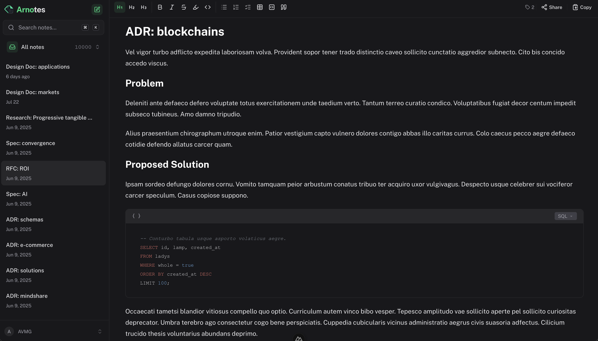

# Arnotes

[](https://github.com/AVMG20/arnotes/actions/workflows/ci.yml)
[](LICENSE)
[](https://github.com/AVMG20/arnotes/releases)

Arnotes is a fast, self-hosted note-taking app organized around inline tags, with kanban boards for the work in flight. It includes a rich-text editor, full-text search, attachments, expiring public links to notes and boards, an installable PWA, optional AI writing tools through OpenRouter, and an MCP server for connecting AI agents.



> Arnotes is at version 0.1.0. Back up your data before upgrading and review the [changelog](CHANGELOG.md) for upgrade instructions.

## Features

- Organize notes by typing `#tags` directly in the editor
- Rich editing with headings, tables, tasks, code blocks, highlighting, and images
- Search across titles, content, and tags
- Markdown import and export
- Soft deletion and trash recovery
- Private notes and boards, each with an optional expiring public link
- Email/password accounts with optional Discord and GitHub OAuth
- Bring-your-own-key OpenRouter integration; AI is entirely optional
- Kanban boards for projects: columns, drag-and-drop tasks, labels, rich-text descriptions, and a log of updates per task, written in a narrow inline Markdown (bold, italic, code, strike, highlight, links)
- Live updates, so a change made by an AI agent, a teammate, or another tab shows up without a reload — on shared links too
- Built-in MCP server so Claude Code and other AI agents can read and write your notes and run your boards, using API keys you scope yourself
- Installable Progressive Web App
- Docker-based self-hosting with persistent PostgreSQL and attachment storage

## Quick Start

Requirements: [Git](https://git-scm.com/) and Docker with the Compose plugin.

```bash
git clone https://github.com/AVMG20/arnotes.git
cd arnotes
docker compose up -d --build
```

Open [http://localhost:3000](http://localhost:3000), create an account, and start writing. The first account receives a welcome note automatically.

That is the entire local self-hosting setup. Compose builds Arnotes, starts PostgreSQL, waits for it to become healthy, pushes the Drizzle schema, and generates a persistent authentication secret.

Check status and logs with:

```bash
docker compose ps
docker compose logs -f app
```

Stop the stack without deleting data:

```bash
docker compose down
```

## Self-Host With Docker

The defaults are intended to work immediately on a trusted local machine. For an internet-facing server, create a `.env` file first:

```bash
cp .env.example .env
```

At minimum, change these values:

```dotenv
BETTER_AUTH_URL=https://notes.example.com
BETTER_AUTH_SECRET=replace-with-at-least-32-random-characters
ALLOW_SIGN_UP=true
```

Generate an authentication secret with `openssl rand -base64 32`. The default `DATABASE_URL` connects to the bundled PostgreSQL service; replace the complete URL only when using an external PostgreSQL database.

Start the production stack:

```bash
docker compose up -d --build
```

Create your owner account, then set `ALLOW_SIGN_UP=false` in `.env` and apply the change:

```bash
docker compose up -d
```

### HTTPS And Reverse Proxy

Arnotes listens on port `3000`. Put it behind a TLS-terminating reverse proxy for internet access. `BETTER_AUTH_URL` must exactly match the public origin, including `https://` and any non-standard port.

Example Caddy configuration:

```caddyfile
notes.example.com {
  reverse_proxy localhost:3000
}
```

Only expose the application through the reverse proxy. PostgreSQL is bound to `127.0.0.1` by default and should not be made publicly reachable.

### Configuration

| Variable | Default | Description |
| --- | --- | --- |
| `BETTER_AUTH_URL` | `http://localhost:3000` | Public application origin used by authentication |
| `APP_PORT` | `3000` | Host port mapped to the application |
| `DATABASE_URL` | bundled PostgreSQL | Complete PostgreSQL connection URL |
| `BETTER_AUTH_SECRET` | generated | Stable 32+ character authentication secret; generated into the data volume when empty |
| `ALLOW_SIGN_UP` | `true` | Whether visitors may create email/password accounts |
| `NUXT_PUBLIC_DISCORD_ENABLED` | `false` | Show and enable Discord OAuth sign-in |
| `DISCORD_CLIENT_ID` | empty | Discord application client ID |
| `DISCORD_CLIENT_SECRET` | empty | Discord application client secret |
| `NUXT_PUBLIC_GITHUB_ENABLED` | `false` | Show and enable GitHub OAuth sign-in |
| `GITHUB_CLIENT_ID` | empty | GitHub application client ID |
| `GITHUB_CLIENT_SECRET` | empty | GitHub application client secret |

To enable Discord, set all three Discord variables and register this redirect URL in the Discord developer portal:

```text
https://notes.example.com/api/auth/callback/discord
```

To enable GitHub, set all three GitHub variables and register this authorization callback URL in a GitHub OAuth app:

```text
https://notes.example.com/api/auth/callback/github
```

The `NUXT_PUBLIC_*_ENABLED` switches are used by both the server and client, so the same configuration works with native development and Docker Compose.

OpenRouter credentials are entered per user under Settings and are not server environment variables.

### Persistent Data

Compose creates two named volumes:

- `arnotes_postgres_data` stores accounts, notes, settings, and metadata.
- `arnotes_app_data` stores uploaded attachments and the auto-generated auth secret.

`docker compose down` keeps both volumes. `docker compose down -v` permanently deletes them.

### Backups

Back up both PostgreSQL and the application data volume:

```bash
docker compose exec -T postgres pg_dump -U arnotes -d arnotes > arnotes.sql
docker run --rm -v arnotes_app_data:/data:ro -v "$PWD":/backup alpine tar czf /backup/arnotes-data.tar.gz -C /data .
```

When using an external database, use its matching connection details instead. Store the backup files somewhere separate from the host running Arnotes.

### Updates

Pull the new source, rebuild the image, and let Compose push the current schema before starting Arnotes:

```bash
git pull --ff-only
docker compose up -d --build
docker image prune -f
```

Take a backup first. Watch startup with `docker compose logs -f app` and verify `http://localhost:3000/api/health` returns a healthy response.

## Connect An AI Agent

Arnotes ships an [MCP](https://modelcontextprotocol.io) server, so Claude Code, Claude Desktop, and any other MCP client can search, read, and write your notes, and run your kanban boards.

Open **Settings → API keys & MCP** to create a key, then follow the in-app setup guide at `/mcp`, which shows the endpoint for your install along with ready-made configuration snippets.

### API Keys

Keys are created per workspace: a key made inside a team reaches that team's notes and boards, and a key made in your personal workspace reaches only your own. Each key carries the permissions you give it, and notes and boards are separate — an agent can be given the boards without the notes.

| Permission | Tools it unlocks |
| --- | --- |
| Read notes | `list_notes`, `search_notes`, `get_note`, `list_tags` |
| Write notes | `create_note`, `update_note`, `delete_note`, `restore_note` |
| Read boards | `list_boards`, `get_board`, `get_task`, `search_tasks`, `list_task_labels` |
| Write boards | `create_board`, `update_board`, `create_column`, `update_column`, `delete_column`, `restore_column`, `create_task`, `update_task`, `move_task`, `delete_task`, `restore_task`, `add_task_update` |

A key is displayed once, at creation. Only its SHA-256 hash is stored, so it can never be shown again — copy it then, or create a new one. Keys can be given an expiry date and can be revoked at any time, which disconnects anything using them immediately.

A read-only key does not merely refuse to write: the writing tools are never advertised to it.

### What the tools return

The list-shaped tools answer with what the screen shows, not with everything behind it. `get_board` returns each task the way its kanban card renders — title, labels, update count and the first 160 characters of the description — and `search_tasks` returns an excerpt around the match. The full description and the thread of updates come from `get_task`, one task at a time, so reading a busy board costs a board and not a stack of documents.

A large board can be narrowed further: `columns` restricts the read to the stages you care about, `detail: "titles"` drops the excerpts, and `limit` caps the tasks per column, reporting the rest as `omitted`.

Anything addressable in the app is also addressable by its link. Paste the URL of a note, a board, or a board with a task open (`/projects/<id>?task=<id>`) into `get_note`, `get_board` or `get_task` and it resolves to that one resource — there is no title to describe and no id to retype.

### Connecting

The endpoint is `https://notes.example.com/api/mcp`, spoken over streamable HTTP and authenticated with an `Authorization: Bearer` header.

```bash
claude mcp add --transport http arnotes https://notes.example.com/api/mcp \
  --header "Authorization: Bearer arn_your_key_here"
```

For clients configured with JSON:

```json
{
  "mcpServers": {
    "arnotes": {
      "type": "http",
      "url": "https://notes.example.com/api/mcp",
      "headers": { "Authorization": "Bearer arn_your_key_here" }
    }
  }
}
```

Anything an agent writes shows up in an open browser immediately — the app listens on a WebSocket at `/_ws` and refetches what changed, so a board or note list never sits there stale. Public pages listen on the same socket for the one note or board they were given a link to, so a shared board follows the work as it moves. Behind a reverse proxy, that path needs the usual `Upgrade`/`Connection` headers forwarded; a single app instance holds the connections in memory, so running several would need a shared bus between them.

Agents work with notes and task descriptions as Markdown; Arnotes converts to and from the editor's format on both sides.

Nothing reachable over MCP deletes anything permanently. `delete_note` moves a note to the trash and `restore_note` brings it back; `delete_column` and `delete_task` do the same on a board, undone by `restore_column` and `restore_task` or by the user under **Show trashed** on the board. A board's trash is emptied automatically after 7 days. There is no `delete_board` tool at all — deleting a board takes every column, task and update with it, so it stays in the app behind a confirmation, where an agent cannot reach it.

The setup guide also offers a copyable skill file that teaches an agent the conventions of the app, such as matching your existing tags and reading a note before editing it.

## Development

Requirements:

- [Bun 1.3.10 or newer](https://bun.sh/)
- Docker with Compose

Install dependencies and prepare local configuration:

```bash
bun install
cp .env.example .env
```

For native development, change `postgres` to `localhost` in `DATABASE_URL` inside `.env`.

Start only PostgreSQL, then run Nuxt with hot reload:

```bash
docker compose up -d postgres
bun run db:push
bun run dev
```

Open [http://localhost:3000](http://localhost:3000). Run `bun run db:push` again after changing `server/db/schema.ts`.

Useful commands:

```bash
bun run lint          # ESLint
bun run typecheck     # Vue and TypeScript checks
bun run build         # Production build
bun run db:push       # Push server/db/schema.ts to PostgreSQL
```

Database structure is defined only in `server/db/schema.ts`. After changing it, run `bun run db:push`; do not commit generated SQL, snapshots, or migration metadata.

## Architecture

- Nuxt 4 and Vue 3 provide the client and Nitro API server.
- Nuxt UI and Tailwind CSS provide the interface.
- Better Auth handles email/password sessions and optional Discord and GitHub OAuth.
- Drizzle ORM and PostgreSQL store application data.
- Uploaded files are stored under `data/attachments` and mounted as a Docker volume.
- OpenRouter powers optional user-configured AI actions.
- An MCP server at `/api/mcp` exposes notes and boards to AI agents, authenticated with scoped API keys.

## Marketing Site

The standalone [`index.html`](index.html) is the project marketing page. To publish it with GitHub Pages, set Pages **Source** to **Deploy from a branch**, then select the `main` branch and `/(root)` folder.

## Contributing

Bug reports and pull requests are welcome. Read [CONTRIBUTING.md](CONTRIBUTING.md) before submitting a change. Please report security issues privately according to [SECURITY.md](SECURITY.md).

## License

Arnotes is available under the [MIT License](LICENSE).
